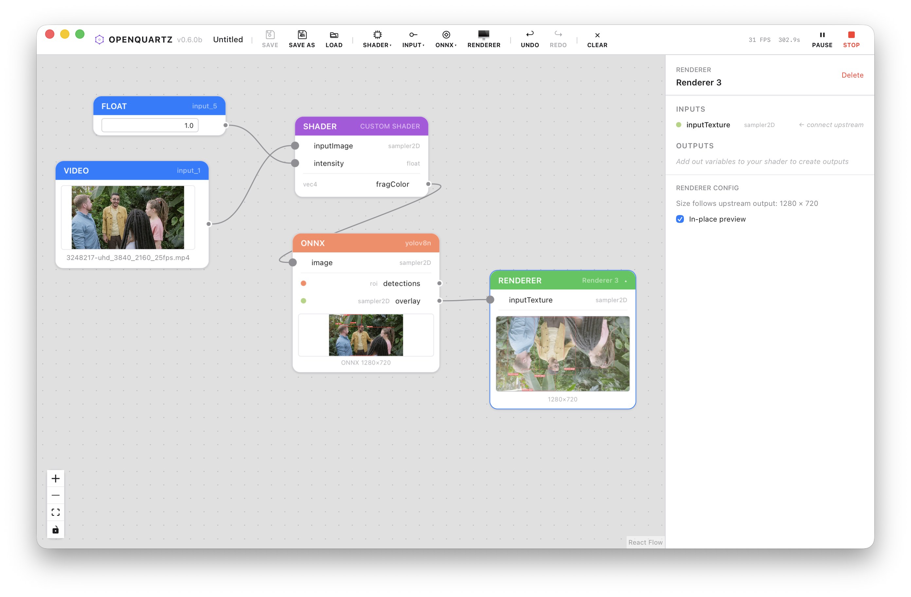

<p align="center">
  
</p>

<h1 align="center">Open Quartz</h1>

<p align="center">
  A hardware-accelerated visual graph editor for image and video processing.
</p>

<p align="center">
  
</p>

Open Quartz is a node-based visual programming environment for real-time image and video processing. Build GPU-accelerated pipelines by connecting shader nodes, video/image inputs, ML inference nodes (ONNX), and renderer outputs on an infinite canvas. Inspired by Apple Quartz Composer and Shadertoy.

## Features

### Node Graph Editor
- **Drag, connect, and arrange** shader nodes on an infinite canvas (React Flow)
- **4 node types**: Shader (custom GLSL), Input (data sources), Renderer (output viewer), ONNX (ML inference)
- **Bezier curve edges** with type-safe connections — ports carry GLSL type metadata
- **MiniMap** for graph overview navigation
- **Box selection** for multi-node operations
- **Fit-to-view** on load

### Input System
- **Grouped INPUT menu** — inputs organized into SCALAR (float/int/bool), VECTOR (vec2/vec3/vec4), and SAMPLER2D (Image/Framebuffer/Video) groups with hover-expand nested sub-menus
- **Image input** — load images as sampler2D textures, with read-only width/height display
- **Framebuffer input** — load raw binary dump files as textures with configurable format (RGBA8 / RGBA32F / RG8 / RG32F / R8 / R32F / NV12), width, height, and stride
- **Video input** — camera and file video as sampler2D textures via HTMLVideoElement / THREE.VideoTexture; video dimensions propagate to downstream shader default size
- **Texture sampling config** — all sampler2D inputs support Filter (LINEAR / NEAREST) and Wrap (CLAMP / REPEAT / MIRROR) settings
- **Immediate preview** — Image, Framebuffer, and Video inputs show preview thumbnails as soon as data is loaded

### Node Inspector & Editor (Side Panel)
- **Editable node label** and type badge
- **CodeMirror 6 shader editor** with GLSL syntax highlighting, error linting, and autocompletion
- **Port inspector** with color-coded data type indicators and inline uniform value editing
- **Per-component vector editing** (x/y/z/w) for vec2/vec3/vec4 uniforms
- **Image loading** for sampler2D input nodes (click or drag-and-drop)
- **Framebuffer config panel** — format dropdown, width/height inputs, stride input
- **Output preview** showing rendered results after graph execution
- **Output Auto Size** — checkbox to auto-infer width/height from inputs; manual override available (1–8192 px)

### Preview Lightbox
- **Full-screen image viewer** — click any image or video preview to open with scroll-to-zoom, drag-to-pan, and double-click reset
- **Nearest-neighbor rendering** — pixelated display for accurate pixel inspection at zoom
- **Save as PNG** — toolbar button with native save dialog (File System Access API) and fallback download
- **Color Picker** — toggle crosshair mode to inspect pixel coordinates (x, y) and RGBA color values with floating tooltip and color swatch

### Realtime Rendering
- **rAF-driven rendering loop** with PLAY / PAUSE / STOP transport controls
- **Host/Compositor architecture** inspired by Quartz Composer's QCRenderer — host drives the frame clock, compositor walks the node graph
- **Shadertoy-compatible builtin uniforms**: `iTime`, `iTimeDelta`, `iFrame`, `iDate`, `iMouse`, `iResolution` — opt-in by declaring e.g. `uniform float iTime;` in your shader to receive auto-injected values
- **GPU-only output path** — no `readPixels` in the realtime loop; preview via mirror canvas blit
- **Clock with pause/resume/seek** — time freezes on PAUSE, resets on STOP, and can be seeked programmatically

### Renderer Node
- **Explicit output viewer** — the Quartz Composer QCView equivalent; green header distinguishes it from shader nodes
- **Input**: single `sampler2D` from an upstream shader
- **In-place preview** on the node canvas or **panel preview** in the side panel
- **Multi-renderer support** — each renderer has its own independent mirror canvas via GPU→GPU blit (`drawImage`)
- **No extra render pass** — reads the upstream FBO directly
- **Fullscreen live preview** with SAVE button for frame capture

### Shader Engine
- **FBO-based multi-pass rendering** via Three.js — each shader node renders to an offscreen framebuffer and passes results downstream
- **HalfFloat FBOs** for input/shader intermediates to preserve float precision through the pipeline
- **Topological sort** ensures correct execution order through the graph
- **Automatic uniform wiring** — connections map upstream output textures to downstream sampler uniforms
- **Scalar uniform injection** — unconnected inputs are editable inline in the inspector
- **Per-node iResolution** — each shader gets its own FBO dimensions, not a single global resolution
- **Builtin uniform AUTO badges** — PortInspector shows AUTO badges for builtin uniforms (iTime, iMouse, etc.)
- **GLSL 300 es** support

### Predefined Shader Templates (10)
- Custom Shader (intensity multiplier)
- Custom 2IN-1 (mix of two sampler2D inputs)
- Sobel Edge Detection
- Gaussian Blur 3×3
- Box Blur
- Sharpen
- Invert
- Grayscale
- Emboss
- Pixelate (with configurable block size)

### ONNX Nodes (experimental)
- **`onnx` node type** — self-contained inference nodes that bundle an ONNX model, run it in-browser, and emit both structured outputs (`roi`, `mesh`, `json`) and a `sampler2D` overlay for downstream shaders.
- **Bundled model: YOLOv8n** (80 COCO classes, ~6MB). Input port `image: sampler2D`, output ports `detections: roi` and `overlay: sampler2D`.
- **Runtime**: `onnxruntime-web` (auto-loaded from `public/ort/ort.min.js` by the wasm bridge) driven by a Rust `wasm-pack` bundle (`rust/crates/yolo-detector`, git-dep on [`caozisheng/rimeflow-yolov8n`](https://github.com/caozisheng/rimeflow-yolov8n)) via `wasm_bindgen(inline_js)`. Prefers WebGPU EP with automatic fallback to WASM EP.
- **Score/IoU thresholds** editable in the side panel; live detection list with class name, confidence, and normalized bbox.
- **Realtime path** — ONNX nodes work in the realtime rendering loop with async non-blocking inference (1–N frame latency).
- **Setup** (once per checkout):
  ```
  npm i -D onnxruntime-web
  npm run copy:ort       # populates public/ort/
  npm run build:wasm     # rebuilds rust/crates/yolo-detector/pkg
  ```
- See `docs/ONNX_NODE_DESIGN.md` for architecture and forward-compatibility notes.


### Project Management
- **Save / Save As** — export your graph as a `.quartz.json` file with native save dialog
- **Load** — import a previously saved project with auto-fit view
- **Editable project name** in the toolbar (double-click to rename)
- **Project file tracking** — SAVE silently overwrites last saved file

### Undo / Redo
- **50-level history** with Cmd/Ctrl+Z (undo) / Cmd/Ctrl+Shift+Z or Cmd/Ctrl+Y (redo)
- Snapshots taken before destructive operations

### GLSL Linting & Autocompletion
- **Real-time error checking** via WebGL2 shader compilation under the hood
- **Error markers** with precise line numbers in the editor gutter
- **Autocompletion** for GLSL keywords, types, built-in functions (52), built-in variables (16), and user-defined variables

### Desktop App (Tauri)
- Runs as a native desktop application via **Tauri 2**
- **Custom titlebar** — no system title bar; app header serves as the drag region
- **macOS**: overlay title bar style with native traffic light controls
- **Windows**: custom minimize/maximize/close buttons
- **Video file persistence** — Tauri asset protocol (`convertFileSrc`) preserves absolute video file paths across sessions
- Same feature set as the web version

## Getting Started

```bash
npm install
npm run build:wasm     # builds ONNX wasm bridge (requires wasm-pack)
npm run dev
```

> **Note:** `build:wasm` is required before first run. The wasm bridge JS/TS bindings are checked into git, but the wasm binary is not. Skipping this step will cause build errors.
>
> `wasm-pack` install: `cargo install wasm-pack`

Open http://localhost:5173 in your browser. See `docs/ONNX_NODE_DESIGN.md` for ONNX architecture details.

## Usage

1. Click **SHADER** dropdown to pick from predefined templates or create a custom shader
2. Click **INPUT** dropdown and hover a group (SCALAR / VECTOR / SAMPLER2D) to add input nodes
3. Add a **RENDERER** node to view shader output — each renderer provides an independent preview
4. Select a shader node to edit its GLSL code in the right panel
5. Drag between port handles to connect nodes
6. Edit uniform values inline in the port inspector
7. Click **PLAY** to start the realtime rendering loop; **PAUSE** to freeze, **STOP** to reset
8. Use `uniform float iTime;` / `uniform vec4 iMouse;` / `uniform vec3 iResolution;` in shaders for time, mouse, and resolution — declared uniforms are auto-injected
9. Click the renderer preview or **FULLSCREEN** to open a live fullscreen view; **SAVE** to export a frame as PNG
10. Click **SAVE** to download a `.quartz.json` project file, or **LOAD** to restore one

## Desktop app (Tauri)

Open Quartz also runs as a native desktop application via [Tauri](https://v2.tauri.app).

### Prerequisites

- [Rust](https://www.rust-lang.org/tools/install) (install via `winget install Rustlang.Rustup` on Windows)

### Development

```bash
npm run tauri dev
```

This starts the Vite dev server and opens the Tauri native window.

### Build

```bash
npm run tauri build
```

Produces a platform-specific installer in `src-tauri/target/release/bundle/`.

## Build (web)

```bash
npm run build
```

Output goes to `dist/`.

## Tech Stack

React 19 · TypeScript 6 · Vite 8 · React Flow 12 · Three.js · Zustand 5 · Immer · CodeMirror 6 · Tailwind CSS 4 · Tauri 2

## License

MIT — see [LICENSE](LICENSE).
